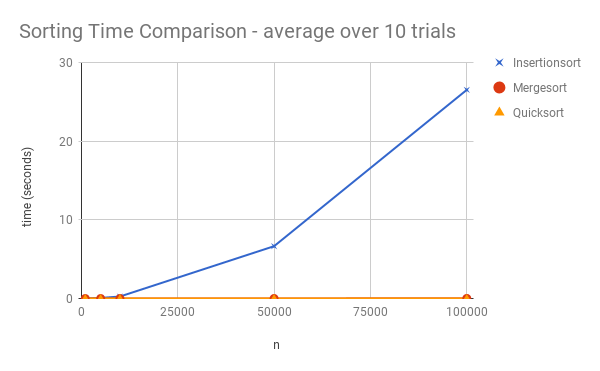
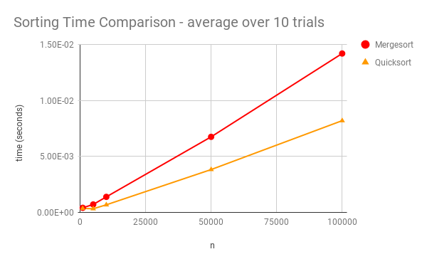

Implementation
----------

Implementations of the following sorting algorithms are included thus far:

- Insertionsort
- Mergesort
- Quicksort

The following charts compare the run times for the sorting algorithms. Insertion sort is the slowest as the input size, n, grows. Merge sort and Quick sort are similar in run times. 





Input 
----------

Refer to input.txt for sample input file consisting of a list of integers.

Usage
----------
An example of the usage of one of the implementations is as follows:

```
$ javac Insertionsort.java
$ java Insertionsort input_small.txt
```
The above run will generate an output.txt file with the sorted array.
